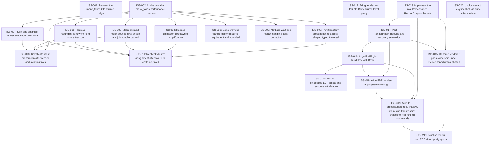

# Markdown Issue Index

Generated by derive-tracker.wasm

## Ready Queue

| ID | Priority | Type | Assignee | Title | Labels |
| --- | ---: | --- | --- | --- | --- |
| [ISS-001](ISS-001.md) | 0 | epic | unassigned | Recover the many_foxes CPU frame budget | performance, many_foxes, render, animation, transform, mesh, pbr |
| [ISS-002](ISS-002.md) | 0 | task | unassigned | Add repeatable many_foxes performance counters | performance, many_foxes, diagnostics |
| [ISS-012](ISS-012.md) | 0 | epic | unassigned | Bring render and PBR to Bevy source-level parity | parity, render, renderer, pbr, bevy-sync |
| [ISS-013](ISS-013.md) | 0 | task | unassigned | Implement the real Bevy-shaped RenderGraph schedule | parity, render, render-graph, renderer |

## Unresolved Issues

| ID | Status | Priority | Type | Assignee | Blocked by | Blocks | Title |
| --- | --- | ---: | --- | --- | --- | --- | --- |
| [ISS-001](ISS-001.md) | open | 0 | epic | unassigned | none | none | Recover the many_foxes CPU frame budget |
| [ISS-002](ISS-002.md) | open | 0 | task | unassigned | none | ISS-003, ISS-004, ISS-005, ISS-006, ISS-007, ISS-008, ISS-009, ISS-010 | Add repeatable many_foxes performance counters |
| [ISS-003](ISS-003.md) | open | 0 | task | unassigned | ISS-002 | ISS-011 | Port transform propagation to a Bevy-shaped typed traversal |
| [ISS-004](ISS-004.md) | open | 0 | task | unassigned | ISS-002 | ISS-011 | Reduce animation target write amplification |
| [ISS-012](ISS-012.md) | open | 0 | epic | unassigned | none | none | Bring render and PBR to Bevy source-level parity |
| [ISS-013](ISS-013.md) | open | 0 | task | unassigned | none | ISS-014, ISS-015, ISS-019 | Implement the real Bevy-shaped RenderGraph schedule |
| [ISS-014](ISS-014.md) | open | 0 | task | unassigned | ISS-013 | ISS-015, ISS-016, ISS-018 | Port RenderPlugin lifecycle and recovery semantics |
| [ISS-016](ISS-016.md) | open | 0 | task | unassigned | ISS-014 | ISS-017, ISS-018, ISS-019 | Align PbrPlugin build flow with Bevy |
| [ISS-018](ISS-018.md) | open | 0 | task | unassigned | ISS-014, ISS-016 | ISS-019 | Align PBR render-app system ordering |
| [ISS-019](ISS-019.md) | open | 0 | task | unassigned | ISS-013, ISS-016, ISS-018 | ISS-021 | Wire PBR prepass, deferred, shadow, main, and transmission phases to real runtime commands |
| [ISS-020](ISS-020.md) | blocked | 0 | task | unassigned | none | none | Unblock exact Bevy meshlet visibility-buffer runtime |
| [ISS-005](ISS-005.md) | open | 1 | task | unassigned | ISS-002 | ISS-010, ISS-011 | Make skinned mesh bounds dirty-driven and joint-cache backed |
| [ISS-006](ISS-006.md) | open | 1 | task | unassigned | ISS-002 | ISS-010, ISS-011 | Remove redundant joint work from skin extraction |
| [ISS-007](ISS-007.md) | open | 1 | task | unassigned | ISS-002 | ISS-010, ISS-011 | Split and optimize render execution CPU work |
| [ISS-015](ISS-015.md) | open | 1 | task | unassigned | ISS-013, ISS-014 | ISS-021 | Rehome renderer pass ownership under Bevy-shaped graph phases |
| [ISS-017](ISS-017.md) | open | 1 | task | unassigned | ISS-016 | none | Port PBR embedded LUT assets and resource initialization |
| [ISS-021](ISS-021.md) | open | 1 | task | unassigned | ISS-015, ISS-019 | none | Establish render and PBR visual parity gates |
| [ISS-008](ISS-008.md) | open | 2 | task | unassigned | ISS-002 | none | Make previous transform sync source-equivalent and bounded |
| [ISS-009](ISS-009.md) | open | 2 | chore | unassigned | ISS-002 | none | Attribute winit and redraw handling cost correctly |
| [ISS-010](ISS-010.md) | open | 3 | task | unassigned | ISS-002, ISS-005, ISS-006, ISS-007 | none | Revalidate mesh preparation after render and skinning fixes |
| [ISS-011](ISS-011.md) | open | 4 | task | unassigned | ISS-003, ISS-004, ISS-005, ISS-006, ISS-007 | none | Recheck cluster assignment after top CPU costs are fixed |

## Dependency Graph

## Warnings

None.

