# Markdown Issue Index

Generated by derive-tracker.wasm

## Ready Queue

| ID | Priority | Type | Assignee | Title | Labels |
| --- | ---: | --- | --- | --- | --- |
| [ISS-001](ISS-001.md) | 0 | epic | unassigned | Recover the many_foxes CPU frame budget | performance, many_foxes, render, animation, transform, mesh, pbr |
| [ISS-012](ISS-012.md) | 0 | epic | unassigned | Bring render and PBR to Bevy source-level parity | parity, render, renderer, pbr, bevy-sync |
| [ISS-022](ISS-022.md) | 0 | epic | unassigned | Restore Bevy source-owner boundaries for non-faithful ports | parity, architecture, bevy-source-boundaries, render2d |
| [ISS-035](ISS-035.md) | 0 | epic | unassigned | Harden ECS APIs for Bevy source-level migration | parity, ecs, bevy-sync, api-shape |
| [ISS-047](ISS-047.md) | 2 | epic | unassigned | Triage failed example screenshot captures | examples, screenshots, visual-parity, capture, triage |
| [ISS-050](ISS-050.md) | 3 | task | unassigned | Classify audio example screenshot capture failures | examples, screenshots, audio, policy |
| [ISS-051](ISS-051.md) | 3 | task | unassigned | Classify ECS state and time screenshot capture failures | examples, screenshots, ecs, state, time, policy |
| [ISS-138](ISS-138.md) | 3 | task | unassigned | Wire Bevy showcase stepping overlay into breakout | examples, breakout, stepping, source-parity, ui |

## Unresolved Issues

| ID | Status | Priority | Type | Assignee | Blocked by | Blocks | Title |
| --- | --- | ---: | --- | --- | --- | --- | --- |
| [ISS-014](ISS-014.md) | in_progress | 0 | task | unassigned | none | ISS-015, ISS-016, ISS-018, ISS-034, ISS-123 | Port RenderPlugin lifecycle and recovery semantics |
| [ISS-025](ISS-025.md) | in_progress | 0 | task | unassigned | none | none | Move camera and Core2d ownership out of sprite/render2d |
| [ISS-026](ISS-026.md) | in_progress | 0 | task | unassigned | none | none | Move UI render overlay paths out of sprite render |
| [ISS-029](ISS-029.md) | in_progress | 0 | task | unassigned | none | ISS-072 | Replace render2d immediate execute monolith with Bevy Core2d phases |
| [ISS-045](ISS-045.md) | in_progress | 0 | task | unassigned | none | ISS-046 | Audit and complete Mesh2d render source parity |
| [ISS-061](ISS-061.md) | in_progress | 0 | bug | unassigned | ISS-065 | none | Fix atmosphere frame view bind group binding 31 failure |
| [ISS-072](ISS-072.md) | in_progress | 0 | task | unassigned | ISS-029 | none | Port Mesh2d ViewKeyCache and full pipeline key owner |
| [ISS-005](ISS-005.md) | in_progress | 1 | task | unassigned | none | ISS-010, ISS-011 | Make skinned mesh bounds dirty-driven and joint-cache backed |
| [ISS-028](ISS-028.md) | in_progress | 1 | task | unassigned | none | none | Move shape conversion and bundle authoring out of render2d runtime |
| [ISS-060](ISS-060.md) | in_progress | 1 | task | unassigned | none | none | Regenerate remaining transparent example references |
| [ISS-064](ISS-064.md) | in_progress | 1 | task | unassigned | none | none | Port Bevy Wireframe3d phase and pipeline source owners |
| [ISS-080](ISS-080.md) | in_progress | 1 | bug | unassigned | none | none | Fix reflection_probes environment and probe lighting parity |
| [ISS-081](ISS-081.md) | in_progress | 1 | bug | unassigned | none | none | Fix ssr scene and screen-space reflection parity before reference refresh |
| [ISS-084](ISS-084.md) | in_progress | 1 | bug | unassigned | none | none | Port mirror extended material and inverted-culling source parity |
| [ISS-085](ISS-085.md) | in_progress | 1 | bug | unassigned | none | none | Port mixed_lighting real lightmap, picking, and widget source parity |
| [ISS-092](ISS-092.md) | in_progress | 1 | bug | unassigned | none | none | Port Bevy skybox pipeline and cubemap source parity before reference refresh |
| [ISS-093](ISS-093.md) | in_progress | 1 | bug | unassigned | none | none | Port SSAO render resources and mesh-view binding 17 before reference refresh |
| [ISS-104](ISS-104.md) | in_progress | 1 | task | unassigned | none | ISS-091, ISS-108, ISS-109 | Port Bevy volumetric fog render pass ownership |
| [ISS-105](ISS-105.md) | in_progress | 1 | task | unassigned | none | none | Audit the latest 173 commits for Bevy source fidelity |
| [ISS-134](ISS-134.md) | in_progress | 1 | task | unassigned | none | none | Port custom shader instancing render owner |
| [ISS-001](ISS-001.md) | open | 0 | epic | unassigned | none | none | Recover the many_foxes CPU frame budget |
| [ISS-004](ISS-004.md) | blocked | 0 | task | unassigned | ISS-043 | ISS-011 | Reduce animation target write amplification |
| [ISS-012](ISS-012.md) | open | 0 | epic | unassigned | none | none | Bring render and PBR to Bevy source-level parity |
| [ISS-016](ISS-016.md) | open | 0 | task | unassigned | ISS-014 | ISS-017, ISS-018, ISS-019, ISS-034, ISS-126 | Align PbrPlugin build flow with Bevy |
| [ISS-018](ISS-018.md) | open | 0 | task | unassigned | ISS-014, ISS-016 | ISS-019, ISS-034 | Align PBR render-app system ordering |
| [ISS-019](ISS-019.md) | open | 0 | task | unassigned | ISS-016, ISS-018 | ISS-021, ISS-034, ISS-123, ISS-126 | Wire PBR prepass, deferred, shadow, main, and transmission phases to real runtime commands |
| [ISS-020](ISS-020.md) | blocked | 0 | task | unassigned | none | none | Unblock exact Bevy meshlet visibility-buffer runtime |
| [ISS-022](ISS-022.md) | open | 0 | epic | unassigned | none | none | Restore Bevy source-owner boundaries for non-faithful ports |
| [ISS-033](ISS-033.md) | open | 0 | task | unassigned | ISS-015 | none | Port screenshot capture to Bevy render-app ownership |
| [ISS-034](ISS-034.md) | open | 0 | task | unassigned | ISS-014, ISS-016, ISS-018, ISS-019 | none | Rehome motion blur pipeline ownership from renderer-local lazy state |
| [ISS-035](ISS-035.md) | open | 0 | epic | unassigned | none | none | Harden ECS APIs for Bevy source-level migration |
| [ISS-044](ISS-044.md) | blocked | 0 | task | unassigned | ISS-070 | ISS-046 | Audit and complete Bevy dim2 primitive source parity |
| [ISS-065](ISS-065.md) | blocked | 0 | task | unassigned | ISS-067 | ISS-061, ISS-107 | Port Bevy AtmospherePlugin render resource owner |
| [ISS-067](ISS-067.md) | blocked | 0 | bug | unassigned | none | ISS-065 | Unblock Bevy atmosphere multiscattering compute dispatch on native Metal |
| [ISS-015](ISS-015.md) | open | 1 | task | unassigned | ISS-014 | ISS-021, ISS-033, ISS-123 | Rehome renderer pass ownership under Bevy-shaped graph phases |
| [ISS-017](ISS-017.md) | open | 1 | task | unassigned | ISS-016 | ISS-126 | Port PBR embedded LUT assets and resource initialization |
| [ISS-021](ISS-021.md) | open | 1 | task | unassigned | ISS-015, ISS-019 | none | Establish render and PBR visual parity gates |
| [ISS-032](ISS-032.md) | blocked | 1 | task | unassigned | ISS-068, ISS-069 | none | Complete ci_testing plugin source parity |
| [ISS-043](ISS-043.md) | blocked | 1 | task | unassigned | none | ISS-004 | Unblock Bevy parallel animation target evaluation |
| [ISS-046](ISS-046.md) | open | 1 | task | unassigned | ISS-044, ISS-045 | none | Remove render-runtime authoring and asset allocation leftovers |
| [ISS-068](ISS-068.md) | blocked | 1 | task | unassigned | none | ISS-032 | Unblock Bevy ci_testing RON configuration loading |
| [ISS-069](ISS-069.md) | blocked | 1 | task | unassigned | none | ISS-032 | Unblock Bevy EasyScreenRecordPlugin and RecordScreen parity |
| [ISS-070](ISS-070.md) | blocked | 1 | task | unassigned | none | ISS-044 | Unblock Bevy Meshable associated builder output shape |
| [ISS-076](ISS-076.md) | blocked | 1 | bug | unassigned | ISS-098 | none | Replace clustered_decal_maps proxy mesh approximation |
| [ISS-083](ISS-083.md) | open | 1 | bug | unassigned | ISS-099 | none | Port lines custom material and line strip source parity |
| [ISS-086](ISS-086.md) | blocked | 1 | bug | unassigned | ISS-100 | none | Port occlusion_culling GPU readback and true culling source parity |
| [ISS-091](ISS-091.md) | blocked | 1 | bug | unassigned | ISS-104 | none | Fix scrolling_fog volumetric fog visual parity before reference refresh |
| [ISS-097](ISS-097.md) | blocked | 1 | task | unassigned | none | none | Unblock Bevy SSAO R16Float storage-format feature query |
| [ISS-098](ISS-098.md) | blocked | 1 | task | unassigned | none | ISS-076, ISS-106, ISS-125 | Expose Bevy binding-array capability checks through wgpu_mbt |
| [ISS-099](ISS-099.md) | blocked | 1 | task | unassigned | none | ISS-083 | Unblock strip-index-format render pipeline descriptors |
| [ISS-100](ISS-100.md) | blocked | 1 | task | unassigned | none | ISS-086 | Expose Bevy-shaped indirect-parameter GPU readback for occlusion culling |
| [ISS-106](ISS-106.md) | blocked | 1 | bug | unassigned | ISS-098 | none | Restore clustered_decals source parity before reference refresh |
| [ISS-107](ISS-107.md) | blocked | 1 | bug | unassigned | ISS-065 | none | Restore atmosphere example source parity after render blocker |
| [ISS-108](ISS-108.md) | blocked | 1 | bug | unassigned | ISS-104 | none | Restore volumetric_fog example source parity |
| [ISS-109](ISS-109.md) | blocked | 1 | bug | unassigned | ISS-104 | none | Restore fog_volumes source parity |
| [ISS-123](ISS-123.md) | open | 1 | task | unassigned | ISS-014, ISS-015, ISS-019 | none | Restore order-independent transparency source parity |
| [ISS-125](ISS-125.md) | open | 1 | task | unassigned | ISS-098 | none | Restore light_textures source parity |
| [ISS-126](ISS-126.md) | open | 1 | bug | unassigned | ISS-016, ISS-017, ISS-019 | none | Restore RectLight render owner and rect_light example parity |
| [ISS-047](ISS-047.md) | open | 2 | epic | unassigned | none | none | Triage failed example screenshot captures |
| [ISS-010](ISS-010.md) | open | 3 | task | unassigned | ISS-005 | none | Revalidate mesh preparation after render and skinning fixes |
| [ISS-050](ISS-050.md) | open | 3 | task | unassigned | none | none | Classify audio example screenshot capture failures |
| [ISS-051](ISS-051.md) | open | 3 | task | unassigned | none | none | Classify ECS state and time screenshot capture failures |
| [ISS-138](ISS-138.md) | open | 3 | task | unassigned | none | none | Wire Bevy showcase stepping overlay into breakout |
| [ISS-011](ISS-011.md) | open | 4 | task | unassigned | ISS-004, ISS-005 | none | Recheck cluster assignment after top CPU costs are fixed |

## Dependency Graph

```mermaid
graph TD
  ISS_001["ISS-001: Recover the many_foxes CPU frame budget"]
  ISS_002["ISS-002: Add repeatable many_foxes performance counters"]
  ISS_003["ISS-003: Port transform propagation to a Bevy-shaped typed traversal"]
  ISS_004["ISS-004: Reduce animation target write amplification"]
  ISS_005["ISS-005: Make skinned mesh bounds dirty-driven and joint-cache backed"]
  ISS_006["ISS-006: Remove redundant joint work from skin extraction"]
  ISS_007["ISS-007: Split and optimize render execution CPU work"]
  ISS_008["ISS-008: Make previous transform sync source-equivalent and bounded"]
  ISS_009["ISS-009: Attribute winit and redraw handling cost correctly"]
  ISS_010["ISS-010: Revalidate mesh preparation after render and skinning fixes"]
  ISS_011["ISS-011: Recheck cluster assignment after top CPU costs are fixed"]
  ISS_012["ISS-012: Bring render and PBR to Bevy source-level parity"]
  ISS_013["ISS-013: Implement the real Bevy-shaped RenderGraph schedule"]
  ISS_014["ISS-014: Port RenderPlugin lifecycle and recovery semantics"]
  ISS_015["ISS-015: Rehome renderer pass ownership under Bevy-shaped graph phases"]
  ISS_016["ISS-016: Align PbrPlugin build flow with Bevy"]
  ISS_017["ISS-017: Port PBR embedded LUT assets and resource initialization"]
  ISS_018["ISS-018: Align PBR render-app system ordering"]
  ISS_019["ISS-019: Wire PBR prepass, deferred, shadow, main, and transmission phases to real runtime commands"]
  ISS_020["ISS-020: Unblock exact Bevy meshlet visibility-buffer runtime"]
  ISS_021["ISS-021: Establish render and PBR visual parity gates"]
  ISS_022["ISS-022: Restore Bevy source-owner boundaries for non-faithful ports"]
  ISS_023["ISS-023: Split sprite/render2d.mbt into Bevy-shaped source owners"]
  ISS_024["ISS-024: Replace sprite_render facades with real owner implementations"]
  ISS_025["ISS-025: Move camera and Core2d ownership out of sprite/render2d"]
  ISS_026["ISS-026: Move UI render overlay paths out of sprite render"]
  ISS_027["ISS-027: Move tilemap chunk ownership out of sprite/render2d and old sprite facades"]
  ISS_028["ISS-028: Move shape conversion and bundle authoring out of render2d runtime"]
  ISS_029["ISS-029: Replace render2d immediate execute monolith with Bevy Core2d phases"]
  ISS_030["ISS-030: Restore Bevy motion blur runtime wiring"]
  ISS_031["ISS-031: Restore motion_blur example ECS source shape"]
  ISS_032["ISS-032: Complete ci_testing plugin source parity"]
  ISS_033["ISS-033: Port screenshot capture to Bevy render-app ownership"]
  ISS_034["ISS-034: Rehome motion blur pipeline ownership from renderer-local lazy state"]
  ISS_035["ISS-035: Harden ECS APIs for Bevy source-level migration"]
  ISS_036["ISS-036: Align Commands spawn and insert APIs with Bundle semantics"]
  ISS_037["ISS-037: Expand Bevy-shaped SystemParam and QueryFilter coverage"]
  ISS_038["ISS-038: Move deferred command state into world and schedule execution context"]
  ISS_039["ISS-039: Standardize generic ECS key-family conventions"]
  ISS_040["ISS-040: Document read-only ECS access as an API contract"]
  ISS_041["ISS-041: Expose Bevy-shaped stage system param APIs"]
  ISS_042["ISS-042: Reduce source-equivalent skin extraction hot-path cost"]
  ISS_043["ISS-043: Unblock Bevy parallel animation target evaluation"]
  ISS_044["ISS-044: Audit and complete Bevy dim2 primitive source parity"]
  ISS_045["ISS-045: Audit and complete Mesh2d render source parity"]
  ISS_046["ISS-046: Remove render-runtime authoring and asset allocation leftovers"]
  ISS_047["ISS-047: Triage failed example screenshot captures"]
  ISS_048["ISS-048: Triage visual 2D and 3D capture failures"]
  ISS_049["ISS-049: Classify app and headless screenshot-ineligible examples"]
  ISS_050["ISS-050: Classify audio example screenshot capture failures"]
  ISS_051["ISS-051: Classify ECS state and time screenshot capture failures"]
  ISS_052["ISS-052: Fix dynamic gameplay math and movement capture failures"]
  ISS_053["ISS-053: Fix UI text and widget capture failures"]
  ISS_054["ISS-054: Classify monitor_info screenshot capture failure"]
  ISS_055["ISS-055: Fix fog example capture blob production"]
  ISS_056["ISS-056: Fix wireframe_2d native capture early exit"]
  ISS_057["ISS-057: Unblock gamepad builds on the current MoonBit toolchain"]
  ISS_058["ISS-058: Unblock moon_cpal builds on the current MoonBit toolchain"]
  ISS_059["ISS-059: Migrate mgstudio physics2d to moon_rapier 0.5 constructors"]
  ISS_060["ISS-060: Regenerate remaining transparent example references"]
  ISS_061["ISS-061: Fix atmosphere frame view bind group binding 31 failure"]
  ISS_062["ISS-062: Fix native capture blob loss for near-black 3D references"]
  ISS_063["ISS-063: Classify intentionally dark visual references in the sanity gate"]
  ISS_064["ISS-064: Port Bevy Wireframe3d phase and pipeline source owners"]
  ISS_065["ISS-065: Port Bevy AtmospherePlugin render resource owner"]
  ISS_066["ISS-066: Port Bevy ScatteringMedium render asset owner"]
  ISS_067["ISS-067: Unblock Bevy atmosphere multiscattering compute dispatch on native Metal"]
  ISS_068["ISS-068: Unblock Bevy ci_testing RON configuration loading"]
  ISS_069["ISS-069: Unblock Bevy EasyScreenRecordPlugin and RecordScreen parity"]
  ISS_070["ISS-070: Unblock Bevy Meshable associated builder output shape"]
  ISS_071["ISS-071: Port Material2d specialize hook and source-shaped pipeline keys"]
  ISS_072["ISS-072: Port Mesh2d ViewKeyCache and full pipeline key owner"]
  ISS_073["ISS-073: Fix voxels3 reference framing before refresh"]
  ISS_074["ISS-074: Restore decal example and forward decal material parity"]
  ISS_075["ISS-075: Fix auto_exposure source parity before reference refresh"]
  ISS_076["ISS-076: Replace clustered_decal_maps proxy mesh approximation"]
  ISS_077["ISS-077: Fix custom_system_setup3 empty capture before reference refresh"]
  ISS_078["ISS-078: Fix render_ui_to_texture dark capture before reference refresh"]
  ISS_079["ISS-079: Fix rotate_environment_map skybox and environment lighting parity"]
  ISS_080["ISS-080: Fix reflection_probes environment and probe lighting parity"]
  ISS_081["ISS-081: Fix ssr scene and screen-space reflection parity before reference refresh"]
  ISS_082["ISS-082: Fix lightmaps CornellBox scene and lightmap parity before reference refresh"]
  ISS_083["ISS-083: Port lines custom material and line strip source parity"]
  ISS_084["ISS-084: Port mirror extended material and inverted-culling source parity"]
  ISS_085["ISS-085: Port mixed_lighting real lightmap, picking, and widget source parity"]
  ISS_086["ISS-086: Port occlusion_culling GPU readback and true culling source parity"]
  ISS_087["ISS-087: Restore pbr example UI label and environment-map source parity"]
  ISS_088["ISS-088: Fix pccm parallax-corrected cubemap scene parity before reference refresh"]
  ISS_089["ISS-089: Port pcss widget controls and shadow source parity"]
  ISS_090["ISS-090: Fix physics3d_sanity material visibility before reference refresh"]
  ISS_091["ISS-091: Fix scrolling_fog volumetric fog visual parity before reference refresh"]
  ISS_092["ISS-092: Port Bevy skybox pipeline and cubemap source parity before reference refresh"]
  ISS_093["ISS-093: Port SSAO render resources and mesh-view binding 17 before reference refresh"]
  ISS_094["ISS-094: Restore custom_skinned_mesh source parity before reference refresh"]
  ISS_095["ISS-095: Restore morph_targets example and morph render capture parity"]
  ISS_096["ISS-096: Fix custom_shader_instancing shader asset loading before reference refresh"]
  ISS_097["ISS-097: Unblock Bevy SSAO R16Float storage-format feature query"]
  ISS_098["ISS-098: Expose Bevy binding-array capability checks through wgpu_mbt"]
  ISS_099["ISS-099: Unblock strip-index-format render pipeline descriptors"]
  ISS_100["ISS-100: Expose Bevy-shaped indirect-parameter GPU readback for occlusion culling"]
  ISS_101["ISS-101: Port Bevy light-probe gather and uniform ownership"]
  ISS_102["ISS-102: Rehome light-probe upload under Bevy render resources"]
  ISS_103["ISS-103: Rehome light-probe bind-group helper ownership"]
  ISS_104["ISS-104: Port Bevy volumetric fog render pass ownership"]
  ISS_105["ISS-105: Audit the latest 173 commits for Bevy source fidelity"]
  ISS_106["ISS-106: Restore clustered_decals source parity before reference refresh"]
  ISS_107["ISS-107: Restore atmosphere example source parity after render blocker"]
  ISS_108["ISS-108: Restore volumetric_fog example source parity"]
  ISS_109["ISS-109: Restore fog_volumes source parity"]
  ISS_110["ISS-110: Restore atmospheric_fog source parity"]
  ISS_111["ISS-111: Restore bloom_3d source parity"]
  ISS_112["ISS-112: Restore color_grading source parity"]
  ISS_113["ISS-113: Restore depth_of_field source parity"]
  ISS_114["ISS-114: Restore contact_shadows source parity"]
  ISS_115["ISS-115: Restore transmission source parity"]
  ISS_116["ISS-116: Restore clearcoat source parity"]
  ISS_117["ISS-117: Restore anisotropy source parity"]
  ISS_118["ISS-118: Restore specular_tint source parity"]
  ISS_119["ISS-119: Restore parallax_mapping source parity"]
  ISS_120["ISS-120: Restore blend_modes source parity"]
  ISS_121["ISS-121: Restore deferred_rendering source parity"]
  ISS_122["ISS-122: Restore anti_aliasing source parity"]
  ISS_123["ISS-123: Restore order-independent transparency source parity"]
  ISS_124["ISS-124: Restore lighting source parity and exposure controls"]
  ISS_125["ISS-125: Restore light_textures source parity"]
  ISS_126["ISS-126: Restore RectLight render owner and rect_light example parity"]
  ISS_127["ISS-127: Restore spherical_area_lights source parity"]
  ISS_128["ISS-128: Restore tonemapping source parity and color-gradient material scene"]
  ISS_129["ISS-129: Restore shadow_biases source parity"]
  ISS_130["ISS-130: Restore spotlight source parity"]
  ISS_131["ISS-131: Restore Bevy-shaped default UI overlay ownership for 3D examples"]
  ISS_132["ISS-132: Port Bevy-shaped standalone 3D MaterialPlugin owner"]
  ISS_133["ISS-133: Add Bevy-shaped mesh picking and pointer drag observer APIs"]
  ISS_134["ISS-134: Port custom shader instancing render owner"]
  ISS_135["ISS-135: Restore Bevy implicit UI target and WorldAssetRoot source shape"]
  ISS_136["ISS-136: Add Bevy-shaped AssetPlugin unapproved path policy"]
  ISS_137["ISS-137: Restore tonemapping Single UI and image-resize source shape"]
  ISS_138["ISS-138: Wire Bevy showcase stepping overlay into breakout"]
  ISS_139["ISS-139: Audit UI text root/span layout parity"]
  ISS_002 --> ISS_003
  ISS_002 --> ISS_004
  ISS_043 --> ISS_004
  ISS_002 --> ISS_005
  ISS_002 --> ISS_006
  ISS_002 --> ISS_007
  ISS_002 --> ISS_008
  ISS_002 --> ISS_009
  ISS_002 --> ISS_010
  ISS_005 --> ISS_010
  ISS_006 --> ISS_010
  ISS_007 --> ISS_010
  ISS_003 --> ISS_011
  ISS_004 --> ISS_011
  ISS_005 --> ISS_011
  ISS_006 --> ISS_011
  ISS_007 --> ISS_011
  ISS_013 --> ISS_014
  ISS_013 --> ISS_015
  ISS_014 --> ISS_015
  ISS_014 --> ISS_016
  ISS_016 --> ISS_017
  ISS_014 --> ISS_018
  ISS_016 --> ISS_018
  ISS_013 --> ISS_019
  ISS_016 --> ISS_019
  ISS_018 --> ISS_019
  ISS_015 --> ISS_021
  ISS_019 --> ISS_021
  ISS_023 --> ISS_024
  ISS_023 --> ISS_025
  ISS_023 --> ISS_026
  ISS_023 --> ISS_027
  ISS_023 --> ISS_028
  ISS_013 --> ISS_029
  ISS_023 --> ISS_029
  ISS_068 --> ISS_032
  ISS_069 --> ISS_032
  ISS_013 --> ISS_033
  ISS_015 --> ISS_033
  ISS_014 --> ISS_034
  ISS_016 --> ISS_034
  ISS_018 --> ISS_034
  ISS_019 --> ISS_034
  ISS_006 --> ISS_042
  ISS_023 --> ISS_044
  ISS_070 --> ISS_044
  ISS_023 --> ISS_045
  ISS_044 --> ISS_046
  ISS_045 --> ISS_046
  ISS_057 --> ISS_060
  ISS_058 --> ISS_060
  ISS_059 --> ISS_060
  ISS_065 --> ISS_061
  ISS_066 --> ISS_065
  ISS_067 --> ISS_065
  ISS_029 --> ISS_072
  ISS_098 --> ISS_076
  ISS_099 --> ISS_083
  ISS_100 --> ISS_086
  ISS_101 --> ISS_088
  ISS_104 --> ISS_091
  ISS_101 --> ISS_102
  ISS_101 --> ISS_103
  ISS_098 --> ISS_106
  ISS_065 --> ISS_107
  ISS_104 --> ISS_108
  ISS_104 --> ISS_109
  ISS_131 --> ISS_112
  ISS_023 --> ISS_121
  ISS_023 --> ISS_122
  ISS_014 --> ISS_123
  ISS_015 --> ISS_123
  ISS_019 --> ISS_123
  ISS_023 --> ISS_124
  ISS_023 --> ISS_125
  ISS_098 --> ISS_125
  ISS_016 --> ISS_126
  ISS_017 --> ISS_126
  ISS_019 --> ISS_126
  ISS_023 --> ISS_126
  ISS_132 --> ISS_128
```

## Warnings

None.

